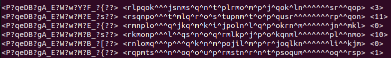

# __Interval Edge-Coloring of 17-Vertex Bipartite Graphs__

An edge-coloring of a graph G with colors 1, . . . , t is an interval t-coloring if all colors are used, and the colors of
edges incident to each vertex of G are distinct and form an interval of integers. 
It is known that bipartite graphs on at most 16 vertices are interval edge colorable.
The smallest known examples of interval non-colorable bipartite graphs have 19 vertices. 

In this project, we observe the interval edge-colorings of 17-vertex bipartite graphs.

Only undirected graphs, without loops and multiple edges are considered.


## __Requirements__
 C++ compiler (such as g++ version 11 or higher)
 Python interpreter

## __Usage__
#### __Generate Graphs__

To generate connected bipartite graphs in graph6 format with (n1,n2) bipartition and save them in the `data` directory, follow these steps:

```
cd interval-edge-coloring
./nauty27r4/genbg -c -g n1 n2 > data/<filename>.txt
```
Replace `<filename>` with a desired name for input file. Make sure to keep ".txt" extension.

Additional commands: https://pallini.di.uniroma1.it/Guide.html


#### __Build and Run__
To build the source code:
```
cd interval-edge-coloring
g++ -o bin/coloring src/main.cpp src/graph_file_handler.cpp src/interval_edge_coloring.cpp
```

To run the program:
```
python3 src/split_and_process_data.py
```

## __Results__

The program outputs result to the `results` directory. 
There are 3 types of output files:
* `colorable-graphs.txt`
* `non-colorable-graphs.txt`
* `time-limited-graphs.txt`


`colorable-graphs` file contains the following data:
```
<graph6> <coloring> <timing in ms>
```
Colored graphs are encoded in graph6 format: https://users.cecs.anu.edu.au/~bdm/data/formats.txt

Edge colorings are encoded in ASCII, where each color has 94 added to it.

`non-colorable-graphs` file contains:
```
<graph6> <timing in ms>
```
`time-limited-graphs`:
```
graph6
```

## __Example__
Let's generate all 17-vertex connected graphs with a bipartition of (4,13) and a minimum degree of 2, and save them in `4-13-d2.txt` in the `data` directory:

```
cd interval-edge-coloring
./nauty27r4/genbg -c -g 4 13 > data/4-13-d2.txt

```

Build and run:

```
g++ -o bin/coloring src/main.cpp src/graph_file_handler.cpp src/interval_edge_coloring.cpp
python3 src/split_and_process_data.py 
```
A total of 51616 graphs were generated. 
Some of these were colored to demonstrate the algorithm, and saved in the `results/colorable-graphs.txt`.

Graphs 14769-14774:



Visualization of the coloring of graph 14769(the 1st one in the image above):


## __Implementation Details__

#### __Graph Generation__
We use the Nauty package to generate graphs.
Specifically, the genbg program from the package allows to generate all bipartite graphs with 17 vertices according to a given bipartition. We can also specify additional constraints, such as minimum and maximum degrees, connectivity, and other options.

#### __Coloring Algorithm__

We represent the bipartite graph G with bipartition (X, Y) and its coloring as a biadjacency matrix B(G) = (b<sub>i,j</sub>)<sub>n×m</sub> , where |X| = n and |Y|= m. b<sub>i,j</sub> is the color of the edge joining the i-th vertex of X and the j-th vertex of Y, if the edge exists, and is set to 0 otherwise. We use backtracking to fill in the matrix with colors. At each step we calculate the set of possible colors for the current matrix cell (by taking into account already colored edges). We color the edge by a randomly selected color from the set of possible colors and move to the next cell. If for some edge the set of possible colors is empty, we return to the previous edge and change the color (if there still exists a color in the set of possible colors). 
The algorithm stops when:
* all the edges are colored
* all the possibilities are tested and the graph has no interval coloring
* time limit is exceeded

## __References__

* H.Khachatrian, T. Mamikonyan, On Interval Edge-Colorings of Bipartite Graphs of Small Order, 2015, 
https://arxiv.org/pdf/1508.02851.pdf

* McKay, B.D. and Piperno, A., Practical Graph Isomorphism, II,
Journal of Symbolic Computation, 60 (2014), pp. 94-112, https://doi.org/10.1016/j.jsc.2013.09.003
